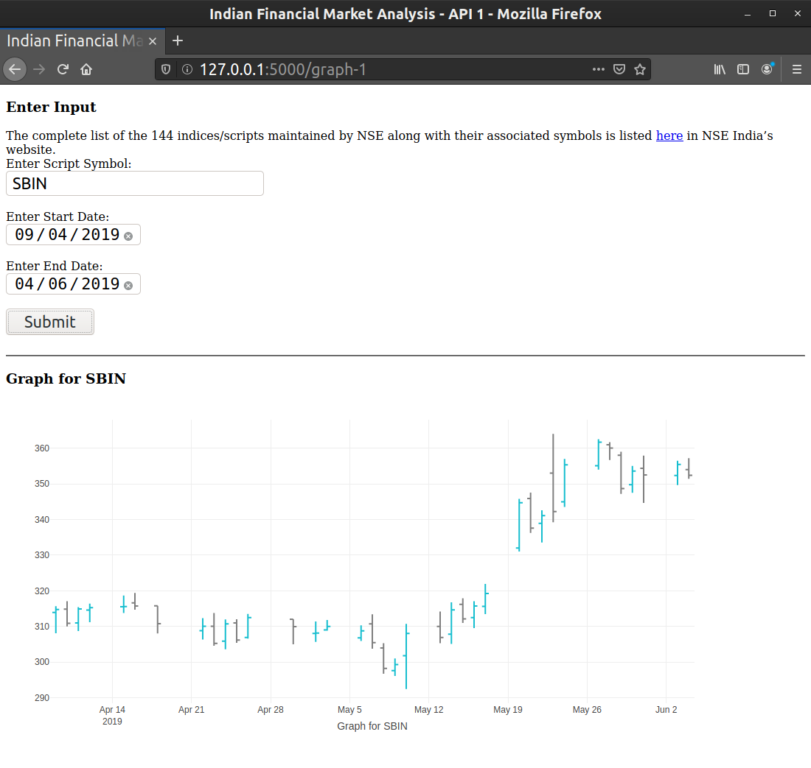
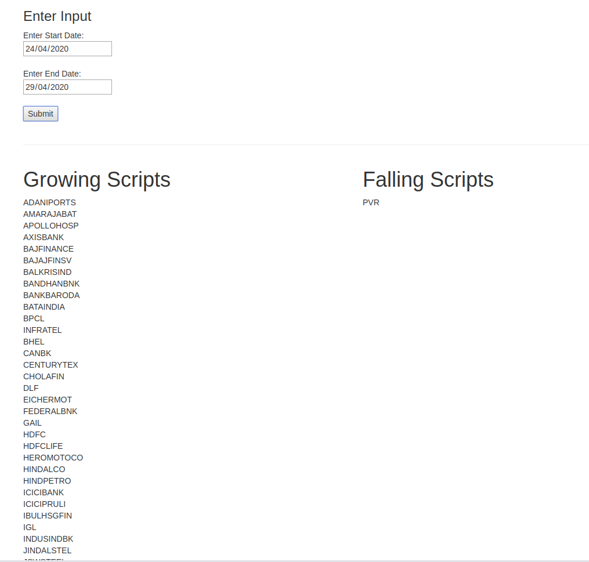

# Indian Financial Market Analysis
## Steps To Run 
Install NSEpy.
```
pip install nsepy 
```
Install BeautifulSoup for python3 (for webscraping)
```
pip3 install beautifulsoup4
```
Install Selenium and chrome webdriver(for JS loaded web scraping)
```
pip install selenium
sudo apt-get install chromium-chromedriver
```

Run the server.
```
python backend_server.py 
```
Index page is at http://127.0.0.1:5000/
## Current Work
1. Implemented backend for API 1 according to Flask - Jquery design pattern.
2. Implementation of frontend for API 1 is almost done.



3. Implemented backend for API 2 according to Flask - Jquery design pattern.
4. Implementation of frontend for API 2 is almost done. 



***

## Introduction
Create an application which will act as a daily stop for analyzing Indian markets. This tool should provide an ability to the end user to plot various scripts listed on the Indian exchanges and do analysis on those scripts. The parameters to the API&#39;s should not be static and should change on the basis of user input. Modeling should be generic and have an ability to extend on the basis of user requirement.

## Scope
1. Given a script name and a time window, fetch and display it&#39;s open and close in a graph.
2. Given a time window, fetch and display the scripts which have only grown/fallen in previous x days.

## Bar Raisers
1. Given a time window, fetch and display the scripts which have had their highs and lows within k%.
2. Given a k%, fetch and display the scripts which have grown/fallen for k% since the previous day.
3. Calculate breadth of market on a particular day. Breadth of the market is a ratio of number of stocks advancing to that of declining.

## Technical Details
The project will have a frontend page which will talk to a backend service which in turn will talk to an open-source data provider and cache the results in a database.
### Frontend
The frontend will consist of lesser than 3 pages. Each page will have a form input and will plot a graph as the output. They will make simple AJAX/GET calls to fetch data from the backend service. To make the AJAX/GET requests, they will use JQuery. To plot the graphs, they will use D3JS which is a popular graphing tool.
### Backend
They will write the backend service in Python and will use python&#39;s SimpleHTTPService module instead of a complex framework such as Django. They will make use of NSEpy which is an open-source library to fetch data about the highs and lows for scripts. They will make use of a SQL/No-SQL database to cache the data from NSEPy.

## Checkpoints
1. Fetch data via the library - NSEpy.
2. Decide on whether to use a SQL/No-SQL database.
3. Cache the data from the NSEpy into the DB.
4. Write the getter API.
5. Make AJAX requests to fetch data from the getter API.
6. Render the data as a graph.
